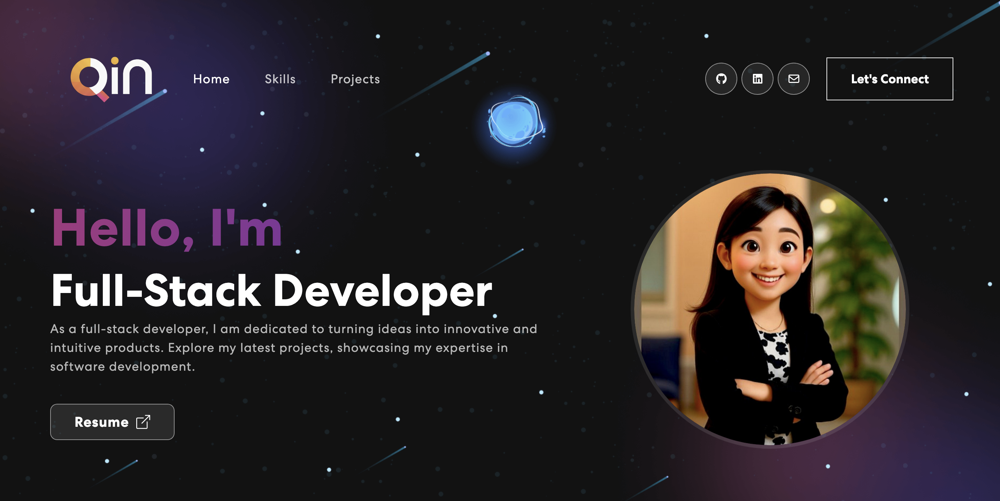

# Personal Portfolio Website 

A fully responsive, animated personal portfolio website built with **React** and **Vite**. This project showcases my skills, projects, and professional background with a modern, dark-themed UI.

🔗 **Live Demo:** [Click here to view the site](https://qinshen-n.github.io/qin_n-portfolio/)

 

## ✨ Features

* **Responsive Design:** Fully optimized for Desktop, Tablet, and Mobile devices.
* **Interactive UI:** Animated text, "Orbit" skills section, and hover effects using `Animate.css`.
* **Contact Form:** Functional contact form integrated with **EmailJS** for real-time emails.
* **Project Showcase:** Dynamic project cards with links to code and live demos.
* **Modern Tech Stack:** Fast performance using Vite and React Bootstrap.

## 🛠️ Tech Stack

* **Languages:** JavaScript (ES6+), HTML5, CSS3
* **Frameworks & Libraries:** React.js, React Bootstrap, Animate.css
* **Tools:** Vite, Git, GitHub Pages, NPM